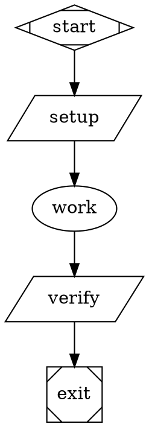
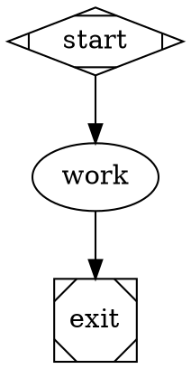

# Sandbox Real-Agent Smoke QA Plan

## Purpose

Manually smoke test the `add-acp-backend` branch with real LLM-backed agents across local, Docker, and Daytona sandbox providers.

The key branch constraint is intentional: ACP requires bidirectional raw stdio and is supported by local and Docker in this cutover, but not by Daytona. This QA plan first proves ACP works through local and Docker sandboxes, then uses Daytona for positive real-agent coverage through the API and CLI backends, and finally verifies ACP-on-Daytona fails clearly instead of falling back to host execution or PTY transport.

## Scope

In scope:

- A real ACP-backed agent running through the local sandbox provider with no container.
- A real ACP-backed agent running in a Docker sandbox.
- A real API-backed agent running in a Daytona sandbox.
- A real CLI-backed agent running in a Daytona sandbox.
- An ACP-backed node on Daytona returning the expected unsupported-provider failure.
- Evidence capture through `inspect`, `events`, `dump`, and optional preserved-sandbox SSH.

Out of scope:

- Automated nextest coverage.
- ACP positive execution on Daytona.
- Full regression of Docker or local ACP behavior beyond this real-agent smoke.
- Snapshot creation performance tuning beyond what is needed to run the smoke.

## Preconditions

- Current branch is `add-acp-backend`.
- Local host has Node/npx available for the no-container ACP smoke.
- Docker is available for the Docker sandbox smoke.
- Daytona API key is available with sandbox/snapshot scopes.
- At least one real LLM credential is available. The commands below use Anthropic.
- GitHub access is configured if the operator chooses not to use `skip_clone = true`.
- Network access from the host, Docker container, and Daytona sandbox allows installing CLI packages.

Recommended environment:

```bash
cargo build -p fabro-cli
export FABRO=./target/debug/fabro

set -a
source .env
set +a

$FABRO doctor -v
```

Required environment variables for the default path:

- `DAYTONA_API_KEY`
- `ANTHROPIC_API_KEY`

## Test Data Setup

Create a scratch directory for manual smoke files:

```bash
mkdir -p smoke tmp
```

Docker and Daytona smoke configs use `skip_clone = true` to avoid depending on pushed branch state. This keeps the test focused on runtime behavior and real agent execution. The local smoke intentionally runs directly in the current working tree because `provider = "local"` has no container boundary; remove `smoke_local_acp_result.txt`, `.fabro-smoke-claude-acp`, and `.fabro-smoke-home/` during cleanup if they remain.

## Smoke 1: Local ACP Backend With Real Agent

### Goal

Prove a real ACP-backed agent can run through the local sandbox provider without a container, use bidirectional raw stdio, and mutate the local workflow filesystem.

### Files

Create `smoke/local_acp.fabro`:



Create `smoke/local_acp.toml`:

```toml
_version = 1

[workflow]
graph = "local_acp.fabro"

[run.sandbox]
provider = "local"

[[run.prepare.steps]]
script = '''
set -eu
NODE_DIR="$(dirname "$(command -v node)")"
NPX_PATH="$(command -v npx)"
cat > .fabro-smoke-claude-acp <<SH
set -eu
export HOME="\${HOME:-\$PWD/.fabro-smoke-home}"
mkdir -p "\$HOME"
export PATH="$NODE_DIR:/usr/local/bin:/usr/bin:/bin:\${PATH:-}"
exec "$NPX_PATH" -y @zed-industries/claude-code-acp@latest
SH
chmod +x .fabro-smoke-claude-acp
'''
```

### Run

```bash
$FABRO run --auto-approve smoke/local_acp.toml
```

### Pass Criteria

- Run exits successfully.
- The `verify` stage prints `local-acp-ok`.
- `fabro events <run-id> --tail 200` includes:
  - `agent.acp.started`
  - `agent.acp.completed`
  - `stage.completed` for `work`
  - `stage.completed` for `verify`
- Events do not include `agent.session.activated` for the `work` stage.
- Events do not include `agent.cli.started` for the `work` stage.
- `fabro inspect <run-id>` shows the run succeeded.
- The local working tree contains `smoke_local_acp_result.txt` with exactly `local-acp-ok`.

### Failure Notes

- Missing `node` or `npx` on the host is a setup failure for this no-container smoke.
- A successful run with API or CLI events instead of ACP events is a branch failure because ACP silently fell back to another backend.
- The local provider writes directly into the current working tree; check `git status` before cleanup.

## Smoke 2: Docker ACP Backend With Real Agent

### Goal

Prove a real ACP-backed agent can run inside a Docker sandbox, use bidirectional non-PTY stdio through Docker exec, and mutate only the container workspace.

### Files

Create `smoke/docker_acp.fabro`:


Create `smoke/docker_acp.toml`:

```toml
_version = 1

[workflow]
graph = "docker_acp.fabro"

[run.sandbox]
provider = "docker"
preserve = true

[run.sandbox.docker]
image = "buildpack-deps:noble"
network_mode = "bridge"
memory_limit = "4GB"
cpu_quota = 200000
skip_clone = true

[[run.prepare.steps]]
script = '''
set -eu
mkdir -p "$HOME/.local"
if ! command -v node >/dev/null 2>&1; then
  curl -fsSL https://nodejs.org/dist/v22.14.0/node-v22.14.0-linux-x64.tar.gz | tar -xz --strip-components=1 -C "$HOME/.local"
fi
export PATH="$HOME/.local/bin:$PATH"
npm --version
npx --version
NODE_DIR="$(dirname "$(command -v node)")"
NPX_PATH="$(command -v npx)"
cat > .fabro-smoke-claude-acp <<SH
set -eu
export HOME="\${HOME:-\$PWD/.fabro-smoke-home}"
mkdir -p "\$HOME"
export PATH="$NODE_DIR:/usr/local/bin:/usr/bin:/bin:\${PATH:-}"
exec "$NPX_PATH" -y @zed-industries/claude-code-acp@latest
SH
chmod +x .fabro-smoke-claude-acp
'''
```

### Run

```bash
$FABRO run --auto-approve smoke/docker_acp.toml
```

### Pass Criteria

- Run exits successfully.
- The `verify` stage prints `docker-acp-ok`.
- `fabro events <run-id> --tail 200` includes:
  - `sandbox.ready`
  - `setup.started`
  - `setup.completed`
  - `agent.acp.started`
  - `agent.acp.completed`
  - `stage.completed` for `verify`
- Events do not include `agent.session.activated` for the `work` stage.
- Events do not include `agent.cli.started` for the `work` stage.
- `fabro inspect <run-id>` shows the run succeeded.
- The preserved Docker sandbox contains `smoke_docker_acp_result.txt` with exactly `docker-acp-ok`.

### Failure Notes

- Docker daemon, image pull, or package-install failures are setup failures unless the error indicates ACP stdio or sandbox routing broke.
- A successful run with API or CLI events instead of ACP events is a branch failure because ACP silently fell back to another backend.

## Smoke 3: Daytona API Backend With Real Agent

### Goal

Prove a real provider API agent can use Fabro-managed tools inside the Daytona sandbox and mutate the sandbox filesystem.

### Files

Create `smoke/daytona_api.fabro`:


Create `smoke/daytona_api.toml`:

```toml
_version = 1

[workflow]
graph = "daytona_api.fabro"

[run.sandbox]
provider = "daytona"
preserve = true

[run.sandbox.daytona]
skip_clone = true
auto_stop_interval = 60
```

### Run

```bash
$FABRO run --auto-approve smoke/daytona_api.toml
```

### Pass Criteria

- Run exits successfully.
- The `verify` stage prints `daytona-api-ok`.
- `fabro events <run-id> --tail 200` includes:
  - `sandbox.ready`
  - `agent.session.activated`
  - `stage.completed` for `work`
  - `stage.completed` for `verify`
- `fabro inspect <run-id>` shows the run succeeded.

### Failure Notes

- Provider authentication failures are setup failures unless the error indicates sandbox routing or missing Daytona state.
- Missing `smoke_api_result.txt` after a successful agent stage is a failure.

## Smoke 4: Daytona CLI Backend With Real Agent

### Goal

Prove the branch runs a real external CLI agent inside Daytona when the CLI is preinstalled by the workflow environment. This also confirms Fabro no longer installs CLIs implicitly at stage runtime.

### Files

Create `smoke/daytona_cli.fabro`:


Create `smoke/daytona_cli.toml`:

```toml
_version = 1

[workflow]
graph = "daytona_cli.fabro"

[run.sandbox]
provider = "daytona"
preserve = true

[run.sandbox.daytona]
skip_clone = true
auto_stop_interval = 60

[[run.prepare.steps]]
script = '''
set -eu
mkdir -p "$HOME/.local"
if ! command -v node >/dev/null 2>&1; then
  curl -fsSL https://nodejs.org/dist/v22.14.0/node-v22.14.0-linux-x64.tar.gz | tar -xz --strip-components=1 -C "$HOME/.local"
fi
export PATH="$HOME/.local/bin:$PATH"
npm config set prefix "$HOME/.local"
command -v claude >/dev/null 2>&1 || npm install -g @anthropic-ai/claude-code
claude --version
'''
```

### Run

```bash
$FABRO run --auto-approve smoke/daytona_cli.toml
```

### Pass Criteria

- Run exits successfully.
- The `verify` stage prints `daytona-cli-ok`.
- `fabro events <run-id> --tail 200` includes:
  - `setup.started`
  - `setup.completed`
  - `agent.cli.started`
  - `agent.cli.completed`
  - `stage.completed` for `verify`
- Events do not include new `cli.ensure.started`, `cli.ensure.completed`, or `cli.ensure.failed` entries for this branch's runtime path.

### Failure Notes

- `CLI backend requires 'claude' to be installed in the sandbox PATH` means the prepare step did not install the CLI where the backend expects it. Treat this as environment/setup failure unless the prepare logs prove `claude` was installed in `$HOME/.local/bin`.
- CLI package-install failures may be caused by Daytona network policy or npm registry availability.

## Smoke 5: Daytona ACP Backend Expected Unsupported Failure

### Goal

Prove ACP on Daytona fails explicitly because Daytona lacks bidirectional raw stdio support. This test guards against unsafe fallbacks such as running ACP on the host or over a PTY.

### Files

Create `smoke/daytona_acp_unsupported.fabro`:



Create `smoke/daytona_acp_unsupported.toml`:

```toml
_version = 1

[workflow]
graph = "daytona_acp_unsupported.fabro"

[run.sandbox]
provider = "daytona"
preserve = true

[run.sandbox.daytona]
skip_clone = true
auto_stop_interval = 60
```

### Run

```bash
$FABRO run --auto-approve smoke/daytona_acp_unsupported.toml
```

### Pass Criteria

- Run fails.
- The failure text contains:
  - `ACP backend requires bidirectional stdio`
  - `Daytona sandbox provider does not support it yet`
- Events include `agent.acp.started`.
- Events do not include `agent.acp.completed`.
- The preserved Daytona sandbox does not contain `smoke_acp_result.txt`.

### Failure Notes

- If the run succeeds, that is a failure for this branch because ACP should not execute on Daytona.
- If the failure is about `acp_command` missing, the workflow file is wrong.
- If the failure is about `npx` missing before the Daytona unsupported error, inspect the code path: the smoke should prove the sandbox stdio provider boundary, not package availability.

## Optional Variant: Codex Or Gemini CLI On Daytona

If Anthropic CLI smoke passes and broader real-agent coverage is desired, repeat Smoke 4 with another provider:

- OpenAI CLI: install `@openai/codex`, use `provider="openai"`, and require `OPENAI_API_KEY`.
- Gemini CLI: install `@google/gemini-cli`, use `provider="gemini"`, and require `GEMINI_API_KEY`.

Keep these as optional because they increase external-provider flake surface without changing the branch's Daytona ACP boundary.

## Verification Checklist

Use this checklist as the operator-facing record for the smoke. Fill in run IDs and notes as each step completes.

### Preconditions

- [ ] Current branch is `add-acp-backend`.
- [ ] `cargo build -p fabro-cli` completed successfully.
- [ ] `FABRO=./target/debug/fabro` is exported for the shell running the smoke.
- [ ] `.env` is loaded.
- [ ] `$FABRO doctor -v` completed without a blocking environment error.
- [ ] Host `node` is available for the local ACP smoke.
- [ ] Host `npx` is available for the local ACP smoke.
- [ ] Docker is available for the Docker sandbox smoke.
- [ ] `DAYTONA_API_KEY` is present and has sandbox/snapshot scopes.
- [ ] `ANTHROPIC_API_KEY` is present for the default Anthropic smoke path.
- [ ] Host, Docker, and Daytona network paths can install CLI packages.
- [ ] `smoke/` and `tmp/` directories exist.

### Smoke 1: Local ACP Backend

- [ ] Created `smoke/local_acp.fabro`.
- [ ] Created `smoke/local_acp.toml`.
- [ ] Config uses `provider = "local"`.
- [ ] Prepare step creates `.fabro-smoke-claude-acp`.
- [ ] Ran `$FABRO run --auto-approve smoke/local_acp.toml`.
- [ ] Recorded local ACP smoke run ID: `________________`.
- [ ] Run exited successfully.
- [ ] `verify` stage printed `local-acp-ok`.
- [ ] Events include `agent.acp.started`.
- [ ] Events include `agent.acp.completed`.
- [ ] Events include `stage.completed` for `work`.
- [ ] Events include `stage.completed` for `verify`.
- [ ] Events do not include `agent.session.activated` for the `work` stage.
- [ ] Events do not include `agent.cli.started` for the `work` stage.
- [ ] `fabro inspect <run-id>` shows the run succeeded.
- [ ] Local working tree contains `smoke_local_acp_result.txt` with exactly `local-acp-ok`.

### Smoke 2: Docker ACP Backend

- [ ] Created `smoke/docker_acp.fabro`.
- [ ] Created `smoke/docker_acp.toml`.
- [ ] Config uses Docker with `preserve = true`.
- [ ] Config uses `skip_clone = true`.
- [ ] Prepare step installs or verifies Node.
- [ ] Prepare step verifies `npx`.
- [ ] Prepare step creates `.fabro-smoke-claude-acp`.
- [ ] Ran `$FABRO run --auto-approve smoke/docker_acp.toml`.
- [ ] Recorded Docker ACP smoke run ID: `________________`.
- [ ] Run exited successfully.
- [ ] `verify` stage printed `docker-acp-ok`.
- [ ] Events include `sandbox.ready`.
- [ ] Events include `setup.started`.
- [ ] Events include `setup.completed`.
- [ ] Events include `agent.acp.started`.
- [ ] Events include `agent.acp.completed`.
- [ ] Events include `stage.completed` for `verify`.
- [ ] Events do not include `agent.session.activated` for the `work` stage.
- [ ] Events do not include `agent.cli.started` for the `work` stage.
- [ ] `fabro inspect <run-id>` shows the run succeeded.
- [ ] Preserved Docker sandbox contains `smoke_docker_acp_result.txt` with exactly `docker-acp-ok`.

### Smoke 3: Daytona API Backend

- [ ] Created `smoke/daytona_api.fabro`.
- [ ] Created `smoke/daytona_api.toml`.
- [ ] Config uses Daytona with `preserve = true`.
- [ ] Config uses `skip_clone = true`.
- [ ] Ran `$FABRO run --auto-approve smoke/daytona_api.toml`.
- [ ] Recorded Daytona API smoke run ID: `________________`.
- [ ] Run exited successfully.
- [ ] `verify` stage printed `daytona-api-ok`.
- [ ] Events include `sandbox.ready`.
- [ ] Events include `agent.session.activated`.
- [ ] Events include `stage.completed` for `work`.
- [ ] Events include `stage.completed` for `verify`.
- [ ] `fabro inspect <run-id>` shows the run succeeded.
- [ ] Preserved Daytona sandbox contains `smoke_api_result.txt` with exactly `daytona-api-ok`.

### Smoke 4: Daytona CLI Backend

- [ ] Created `smoke/daytona_cli.fabro`.
- [ ] Created `smoke/daytona_cli.toml`.
- [ ] Config uses Daytona with `preserve = true`.
- [ ] Config uses `skip_clone = true`.
- [ ] Prepare step installs or verifies Node.
- [ ] Prepare step installs or verifies `claude` in the sandbox PATH.
- [ ] Prepare step prints `claude --version`.
- [ ] Ran `$FABRO run --auto-approve smoke/daytona_cli.toml`.
- [ ] Recorded Daytona CLI smoke run ID: `________________`.
- [ ] Run exited successfully.
- [ ] `verify` stage printed `daytona-cli-ok`.
- [ ] Events include `setup.started`.
- [ ] Events include `setup.completed`.
- [ ] Events include `agent.cli.started`.
- [ ] Events include `agent.cli.completed`.
- [ ] Events include `stage.completed` for `verify`.
- [ ] Events do not include `cli.ensure.started`.
- [ ] Events do not include `cli.ensure.completed`.
- [ ] Events do not include `cli.ensure.failed`.
- [ ] Preserved Daytona sandbox contains `smoke_cli_result.txt` with exactly `daytona-cli-ok`.

### Smoke 5: Daytona ACP Unsupported Failure

- [ ] Created `smoke/daytona_acp_unsupported.fabro`.
- [ ] Created `smoke/daytona_acp_unsupported.toml`.
- [ ] Config uses Daytona with `preserve = true`.
- [ ] Config uses `skip_clone = true`.
- [ ] Ran `$FABRO run --auto-approve smoke/daytona_acp_unsupported.toml`.
- [ ] Recorded Daytona ACP smoke run ID: `________________`.
- [ ] Run failed.
- [ ] Failure text contains `ACP backend requires bidirectional stdio`.
- [ ] Failure text contains `Daytona sandbox provider does not support it yet`.
- [ ] Events include `agent.acp.started`.
- [ ] Events do not include `agent.acp.completed`.
- [ ] Preserved Daytona sandbox does not contain `smoke_acp_result.txt`.
- [ ] No evidence shows ACP ran on the host.
- [ ] No evidence shows ACP used a PTY fallback.
- [ ] No evidence shows ACP silently fell back to API or CLI.

### Evidence Capture

For each required run:

- [ ] Captured `$FABRO inspect <run-id>`.
- [ ] Captured `$FABRO events <run-id> --tail 200`.
- [ ] Captured `$FABRO dump --output tmp/<run-id>-dump <run-id>`.
- [ ] Recorded command used.
- [ ] Recorded final status.
- [ ] Recorded relevant event names.
- [ ] Recorded any external-provider or sandbox infrastructure errors.

For provider-specific filesystem checks:

- [ ] Inspected local working tree files directly.
- [ ] Inspected preserved Docker filesystem with `$FABRO sandbox ssh <run-id>`.
- [ ] Inspected preserved Daytona filesystem with `$FABRO sandbox ssh <run-id>`.
- [ ] Recorded whether expected files exist in the expected provider workspace.

### Cleanup And Final Acceptance

- [ ] Removed each run with `$FABRO rm -f <run-id>` after evidence capture.
- [ ] Removed local smoke artifacts: `smoke_local_acp_result.txt`, `.fabro-smoke-claude-acp`, and `.fabro-smoke-home/`.
- [ ] Verified preserved Docker sandbox is gone with Docker or `fabro inspect <run-id>`.
- [ ] Verified preserved Daytona sandboxes are gone from the Daytona dashboard or `fabro inspect <run-id>`.
- [ ] Local ACP backend smoke succeeded with a real agent and no API/CLI fallback.
- [ ] Docker ACP backend smoke succeeded with a real agent and no API/CLI fallback.
- [ ] Daytona API backend smoke succeeded with a real agent.
- [ ] Daytona CLI backend smoke succeeded with a real agent after explicit CLI installation in prepare steps.
- [ ] Daytona ACP smoke failed with the expected unsupported bidirectional-stdio message.
- [ ] Captured events and dumps are sufficient to diagnose any failure without rerunning immediately.

## Evidence Capture Commands

For each run, capture:

```bash
$FABRO inspect <run-id>
$FABRO events <run-id> --tail 200
$FABRO dump --output tmp/<run-id>-dump <run-id>
```

For the local smoke, inspect the local filesystem. For preserved Docker and Daytona sandboxes, inspect the provider filesystem:

```bash
cat smoke_local_acp_result.txt 2>/dev/null || true

$FABRO sandbox ssh <run-id>
pwd
ls -la
cat smoke_docker_acp_result.txt 2>/dev/null || true
cat smoke_api_result.txt 2>/dev/null || true
cat smoke_cli_result.txt 2>/dev/null || true
cat smoke_acp_result.txt 2>/dev/null || true
exit
```

Record for each run:

- Run ID.
- Command used.
- Final status.
- Relevant event names.
- Whether expected files exist in the expected local, Docker, or Daytona workspace.
- Any external-provider or sandbox infrastructure errors.

## Cleanup

After evidence capture:

```bash
$FABRO rm -f <run-id>
rm -f smoke_local_acp_result.txt .fabro-smoke-claude-acp
rm -rf .fabro-smoke-home
```

Verify preserved Docker and Daytona sandboxes are gone from Docker/Daytona or by rerunning `fabro inspect <run-id>` and confirming no active sandbox remains.

## Final Acceptance Criteria

The branch passes this manual QA plan when:

1. The ACP backend smoke succeeds with a real agent on the local sandbox provider.
2. The ACP backend smoke succeeds with a real agent on the Docker sandbox provider.
3. The API backend smoke succeeds with a real agent on Daytona.
4. The CLI backend smoke succeeds with a real agent on Daytona after explicit CLI installation in prepare steps.
5. The ACP Daytona smoke fails with the expected unsupported bidirectional-stdio message.
6. No evidence shows ACP-on-Daytona ran on the host, used a PTY fallback, or silently fell back to API/CLI.
7. Captured run events and dumps are sufficient to diagnose any failure without rerunning immediately.
